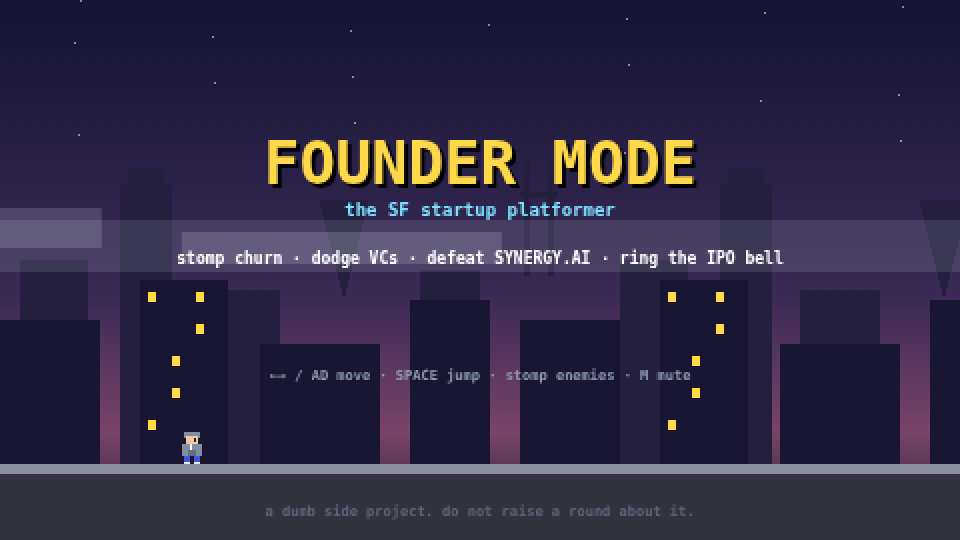

# 🍄 FOUNDER MODE — the SF startup platformer

A single-file, pixel-art, Mario-style browser game satirizing SF tech / AI B2B SaaS culture.
No frameworks, no assets, no build step — one HTML file. Built as a viral side project for LinkedIn.

**Play it right now:** double-click `index.html`. That's the whole install.

## Current build
This is the **QA-hardened war-room build** (post-v0.1): fixed-timestep engine (same speed on every
display), checkpoint respawn with a −25% "bridge round" haircut, pick-your-founder customization
(6 skin tones · 4 hair styles · 6 hoodie colors — C/H/V on the title screen, persists, shows on your
badge), per-zone biomes, 6 background cameo legends, 3 discoverable easter eggs, zone-aware loss
badges, and a hardened share loop (URL baked into the badge PNG, clipboard fallbacks, native share
on mobile). All trademarks removed. `index.v0.1.bak.html` is the original v0.1, untouched.
Newest additions: an optional, local-first claimed identity (`[N]` on the title screen, kept in
localStorage - never a signup wall) and a daily `[L] TODAY'S BOARD` view backed by the serverless
leaderboard; both degrade gracefully offline (hide or show the cached board) and never gate play.

12 bugs were found by adversarial agents running live Playwright probes, independently re-verified,
and fixed with tests green after every change — the paper trail is in `qa/`.

## What's in this kit

| Path | What it is |
|---|---|
| `index.html` | **The entire game.** The only file you need to ship. |
| `index.v0.1.bak.html` | Pristine v0.1 backup. |
| `AGENTS.md` | Session brief for agents - read first, every session (`CLAUDE.md` is a symlink to it). |
| `og.png` | 1200×630 link-preview image (wire up per BUILD-GUIDE Step 4). |
| `api/` | Optional serverless routes: `leaderboard.mjs` (daily board, env-gated) + `og.mjs`. The game runs without them. |
| `docs/FOUNDER-MODE-BIBLE.md` | **Start here.** The unified design bundle: routes, losses, eggs, speedruns, culture pack. |
| `docs/MASTER-PLAN.md` | Lore bible, copy decks, progression, Claude Code milestones, traction gate. |
| `docs/RESEARCH-REPORT.md` | Fact-checked research on why games like this go viral. |
| `docs/BUILD-GUIDE.md` / `LAUNCH-PLAYBOOK.md` / `ROADMAP.md` / `GAME-DESIGN.md` | Deploy steps · distribution plan · v0.3 code · code map. |
| `design/` | The design lab: animated sprite gallery, paste-ready draw functions, validated v1.0 level data (Cerebral Valley), world map, cameo designs. |
| `qa/` | The war room: FINAL-REVIEW (adjudicated findings), CHANGELOG, 4 approved feature specs, proof screenshots. |
| `test/` | Headless Playwright tests — `node test/playtest.js` from the kit root. |
| `screenshots/` | v0.1-era screenshots (badges/bosses still representative). |

## Controls
← → or A/D move · SPACE / ↑ / W jump · **C/H/V/X/P customize your founder · L today's board · N claim identity (title screen)** · M mute · R restart.
Touch controls appear automatically on phones. Rotate to landscape — investors prefer landscape.

## Before you launch (the short list)
1. Replace the `GAME_URL` placeholder in `index.html` with your real URL (or register foundermode.lol).
2. Strip the risky tier from `design/CAMEOS.md` before any public repo push (see `AGENTS.md`).
3. `docs/BUILD-GUIDE.md` Step 2 → public URL. Then `docs/LAUNCH-PLAYBOOK.md`, verbatim.

---
*a dumb side project. do not raise a round about it.*
