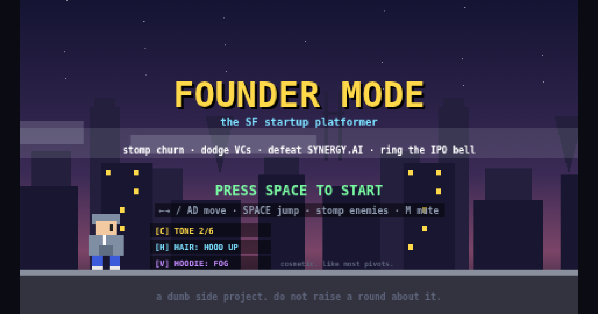

<div align="center">

# SF SPEEDRUN

### how fast can your startup IPO?

**Stomp churn. Dodge VCs. Survive the accelerator. Ring the IPO bell.**

<br>

<a href="https://sfspeedrun.com"></a>

<br><br>


<br>



<br>

*Arrow keys / WASD to move · Space to jump · one file, no signup, no loading screen.*

</div>

---

A Mario-style pixel platformer that satirizes San Francisco startup culture — the whole thing is **one HTML file** of vanilla JavaScript, no framework, no build step, and zero image or audio assets. Every sprite is a stack of `fillRect` calls; every sound is a synthesized oscillator.

**Play it:** [sfspeedrun.com](https://sfspeedrun.com) · **How it's built (as a web page):** [sfspeedrun.com/about.html](https://sfspeedrun.com/about.html) · **Made by:** [ayaan gazali](https://www.linkedin.com/in/ayaangazali)

## Run it locally

There is nothing to install and nothing to build. The game is the file.

```bash
git clone https://github.com/ayaangazali/founder-mode.git
cd founder-mode
open index.html        # or just double-click it — it runs from file://
```

The `api/` serverless functions (leaderboard + share cards) and the PWA files (`manifest.json`, `sw.js`) are optional extras; the game never needs them to run.

## At a glance

| | |
|---|---|
| **Stack** | Vanilla JS + Canvas 2D, ~4,700 lines, one file |
| **Assets** | None — sprites are `fillRect`, audio is WebAudio oscillators |
| **World** | 9,200px across five SF zones, three bosses, one IPO bell |
| **Loop** | Fixed-timestep sim (60 steps/s), simulated `playMs` clock |
| **Mobile** | Installable PWA, plays offline, portrait handheld shell |
| **Backend** | Three tiny serverless functions (daily + all-time leaderboard) |
| **Tests** | 3 Playwright suites + 9 probes + 2 bot profiles + a 4-hour CI sweep |

---

## What it is

SF SPEEDRUN is a Mario-style pixel platformer that satirizes San Francisco startup culture, built to be shared on LinkedIn and played in the gap between two meetings. You are a founder in a hoodie. You run east across 9,200 pixels of San Francisco — from the neon dark of SoMa, through the papel-picado glow of the Mission, up through Cerebral Valley's GPU-lit hacker houses, down Sand Hill Road at golden hour, and finally into THE CLOUD, a white void where the city itself has been deprecated and only the billboards remain. Money is **RAISED**. Health is **RUNWAY**. Death is **OUT OF RUNWAY**. You stomp churn gremlins, dodge sentient calendar invites labeled MTG, out-jump a VC whose gilet is load-bearing, defeat a rogue AI called SYNERGY.AI, and — if you survive — mash a button to ring the IPO bell under a confetti storm while a five-note chiptune fanfare plays. Then the game does the most SF thing possible: it computes your **VALUATION** with visible multiplier math (RAISED × growth story × capital discipline × whether a corgi was on payroll × your pedigree), and if you didn't clear a billion dollars it stamps your share card **CERTIFIED HORSE — you're a horse until you're a unicorn.**

The joke is never just a label. That's the design constitution's first law: *satire lives in the mechanics.* Standing still literally costs you money — idle three seconds and orange text warns "burn rate ticking — MOVE. this is SF." before the tick lands as "BURN RATE — no time for breaks" and eats a heart. Dying doesn't give you a game-over screen; it gives you the front page of **HYPERGROWTH DAILY**, a pixel-perfect newspaper whose headline depends on what killed you ("CHURN FINALLY GETS HIM"), with a two-column obituary, a tilted framed photo of your founder "pictured at peak conviction," a pull quote that reads *"it was a market timing issue" — you, on LinkedIn*, and a stock-ticker footer mourning your current pivot. Retrying isn't retrying — the button says **PIVOT**, it costs you 25% of your money (a "BRIDGE ROUND" haircut), and it renames your company every time: THE COMPANY IS NOW SYNERGYLESS. Die again: SOMETHING WITH AGENTS. The player is the butt of the joke, lovingly, always.

## The heresy of the architecture

The entire game is **one HTML file** — roughly 4,700 lines of vanilla JavaScript, no framework, no bundler, no build step, and **zero image or audio assets**. Every sprite you see — the founder, the corgi, the Transamerica Pyramid, the Golden Gate towers, the painted-ladies row with lit bay windows, the pixel newspaper — is drawn live, every frame, as stacks of `fillRect` calls on a 480×270 canvas. The founder is about thirty rectangles. His hair is six of them, and there are six interchangeable hairstyles (hood up, buzz, curly, ponytail, long, bun) because character customization is five pickers in a handheld-style panel: skin tone, hair, hoodie color, cofounder (including YOUR MOM, who guarantees a once-per-run rescue when you hit zero runway — the phone rings, the screen holds its breath for 72 frames, and the seed round comes through), and pedigree, a ×1-to-×100 valuation multiplier that ranges from SELF-MADE to STANFURD DROPOUT — visible on your sprite as actual gear, and yes, *stanfurd is not a typo. ask berkeley.*

Text is the one place raw canvas scaling would look bad, so the game runs a second, invisible trick: every piece of text is mirrored onto a **hi-resolution overlay canvas** backed at the device's real pixel ratio, so on a 3× phone screen the pixel art stays chunky and nostalgic while every letter stays razor crisp. Two canvases, perfectly registered, one aesthetic.

The heartbeat is a **fixed-timestep simulation**: exactly 60 simulation steps per second through an accumulator, regardless of whether the display runs at 60Hz, 120Hz, or a throttled background tab. State mutates only in `update()`, never in `draw()` — the comments enforce it like a code review. Time itself is simulated: a `playMs` clock that only advances while you're actually playing, so backgrounding the tab doesn't burn your runway and the speedrun timer can't be cheated by the wall clock. The single sanctioned exception is the calendar: every real-world day derives a **daily seed** that picks one of ten market conditions — AUDIT WEEK makes burn tick faster, rate cuts change what a coin is worth, FOG THICK TODAY rolls Karl the Fog over the pits — so the leaderboard resets daily and everyone plays the same weather.

## The world

Physics are a speedrun contract — jump velocity −6.6, gravity 0.35, run speed 1.7 — documented and frozen, because sub-three-minute runs earn the T2D3 badge flair and speedrunners get lawyerly about frames. Around those constants sits real platformer DNA: a 6-frame jump buffer, 5 frames of coyote time, variable jump height, head-bonk corner forgiveness, stomp bounces with hit-stop and screenshake. Enemies are the culture: **churn gremlins** (retention was "a Q3 priority"), **standing meetings** (a white calendar rectangle with legs and eyes in its header), **scooter bros**, **thought leaders** (they hover, haloed, and periodically *post*), **compliance phantoms**. Three bosses are your funding rounds: THE PLATFORM (pre-seed, a DevRel mecha that drops SDK crates that hurt, because breaking changes should break something), CHAD CAPITAL (seed, lobs term sheets in arcs), and SYNERGY.AI (Series A, fires buzzword pills — SLOP, AI-NATIVE, WEB-SCALE — each pill sized to its own text). Your weapon, when you find a briefcase, is your **pitch deck**, thrown flat like a paper shuriken; DECKED! is what it says when it connects.

Between fights: **coffee chats** (three investors at sidewalk tables run timed dialogue minigames — answer "when did you last ship?" with "this morning. twice." and the Operator Angel wires $150K), a seven-question **accelerator interview** behind a door, an **intern fair** (equity: no · exposure: yes), a hackathon house frozen at HOUR 46 OF 48, a rideable robotaxi, a hireable corgi Chief Morale Officer who pauses your burn rate, and powerups that are all groceries of the culture: cold brew, matcha, a term sheet, GOOD PRESS (deflects one bad take), a rug (it's a trap), an **OMNICORP CAMPUS BIKE** — those corporate primary-color bikes lying everywhere around the bay; riding one is faster and a mob hit knocks you off the bike instead of hurting you — and **LOST EARBUDS** found on the sidewalk, which put you in flow state: coins ×2.

## Sound, with no sound files

Audio is synthesized entirely in code through the WebAudio API: one `beep()` function driving oscillators — square-wave coin chirps, a triangle stomp thud, a sawtooth hurt buzz, a rising jump blip, a five-note victory fanfare, and its inversion, a four-note descending market-close bell when you die. Under it all runs a 16-step chiptune sequencer — triangle bass, square lead — clocked off the *simulated* game clock (never `setTimeout`), so pausing pauses the band mid-bar. The same loop transposes per zone: root in SoMa, up five in the Mission, up twelve and floating in THE CLOUD.

## The phone becomes a handheld

On a phone in portrait, the page stops being a website: warm greige console body, dark charcoal screen bezel labeled **DOT MATRIX WITH VENTURE SOUND**, the **OMNICORP GAME BRO™** nameplate stamped in the game's own gold-on-dark chip style, a solid black cross d-pad, two magenta dome buttons set on the classic diagonal (SHOOT pitches your deck, A jumps — labels printed under them on the shell), slanted silver pills for SOUND and START, and a diagonal speaker grille. The game view renders zoomed with a **dynamic camera window** that slides to keep the founder a third in from the left edge, and full-screen scenes (chats, interviews) snap to full width so nothing gets amputated. Add it to your home screen and it installs as a real app — its own icon (the founder under an SF wordmark, generated from the game's own drawing code), fullscreen with no browser chrome, playable offline underground on Muni via a service worker. A blue GET THE APP box greets every title visit with browser-aware directions: Safari users get a card at the bottom with a pulsing arrow at the share button; Chrome users get it at the top, arrow pointing at the address bar.

## The distribution machine

Losing is the growth strategy. Every ending produces two share surfaces — the classic badge and the newspaper — with pre-written LinkedIn-speak copy on the clipboard and a per-run result URL: paste it anywhere and it unfurls as *your* run's card, rendered server-side ("JERRY raised $3.0M and died with a $1.5M valuation (down round). SF claims another founder."). A Supabase-backed **daily leaderboard** (plus an all-time board, currently crowned by a real $1.11B unicorn run) ranks won → valuation → time, guarded by server-side plausibility clamps so a curl artist can't post a forged $40B exit. The whole backend is three tiny serverless functions; the game itself never needs them to run.

## The paranoia (how it stays good)

The repo is half game, half immune system. Three asserting Playwright tests (smoke, playthrough, death) gate every commit. Nine standing probes grep-gate the legal lines — parody celebrity names may exist as draw-only cameos but can never reach a share surface; real-startup billboard names are consent-tracked in a ledger. Two bot profiles play the entire game end-to-end nightly — a frame-tight "clean" speedrunner and a "casual" tourist that reads signs and falls in pits — with death budgets. A CI sweep re-runs everything every four hours, scans for leaked API keys by value-shape, and audits its own dependencies. And when it matters, fleets of AI agents playtest it: ten SF-archetype personas (a skeptical HN graybeard, a Gen-Z thumb-gamer, a VC associate rating the badge's flex value) whose 15-item consensus backlog shipped in one night, and an eight-agent integration sweep that logged 162 passes and caught five bugs — including one where a misplaced code comment silently ate an investor's name, so a *perfect* coffee chat paid $0 while a mediocre one paid $50. Which, honestly, the game itself would consider canon.

## Repo map

| Path | What |
|---|---|
| `index.html` | The entire game — one file, vanilla JS + canvas |
| `about.html` | This writeup, as a styled static page |
| `api/` | Serverless functions: leaderboard, per-run share card, result page |
| `manifest.json` · `sw.js` | PWA install + offline cache (optional) |
| `test/` | Playwright suites + the two end-to-end bot profiles |
| `qa/` | Probes, CI sweep, and evidence screenshots |

---

<div align="center">

One file. No engine. No assets. A city, three funding rounds, a bell — and the most rigorously over-tested joke on the internet.

**[▶ Play SF SPEEDRUN](https://sfspeedrun.com)**

*a dumb side project. do not raise a round about it.*

</div>
